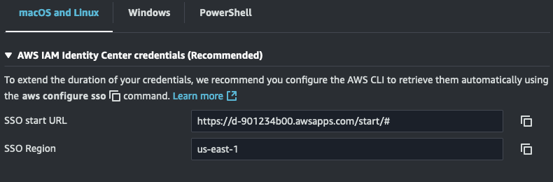

# aws-sso-config-guide
An opinionated guide on how to set up your AWS config file for Identity Center.

I've spent several years administering Identity Center and helping untangle AWS config files that make life harder than they need to be.

Take the suggestions in this guide as just that: suggestions. If a different approach works better for your workflow, great! I'd be interested to hear about it. 

# Setting up your config

## Defining your sso-session

An AWS config file is built with `sso-session` settings and `profile` settings. By default, this file is found at `$HOME/.aws/config`.

Profiles and Sessions have a many-to-one relationship: many profiles can reference one SSO session. Version 2.9.0 of the AWS CLI introduced [SSO token provider configurations](https://docs.aws.amazon.com/sdkref/latest/guide/feature-sso-credentials.html#sso-token-config). Make sure you're using at least this version.

An SSO Session defines how you authenticate to AWS. The required parameters are `sso_start_url`, `sso_region`, `sso_registration_scopes`. You can find these settings in the AWS SSO portal by clicking on “Access keys” next to any role to which you have access.




At the time of this writing, the `sso_registration_scopes` will always be `sso:account:access`. 

You can either create an `sso-session` manually or run `aws configure sso` in your shell. The shell command will prompt you for the `sso-session` name, `sso_start_url`, `sso_region`, and `sso_registration_scopes`. The name of your `sso-session` doesn’t matter, but should be short as it’s commonly referenced.

If you want to create the `sso-session` manually, you can find an example (that you probably don't need) later in this section. 

After you've defined an `sso-session`, you should create a shell alias for authenticating to AWS. Below is an example shell function to log into an SSO Session named “main”:

```shell
awssso(){aws sso login --sso-session main}
```

And here is the corresponding `sso-session` configuration:

```ini
[sso-session main]
sso_start_url = https://d-901234b00.awsapps.com/start/
sso_region = us-east-1
sso_registration_scopes = sso:account:access
```

## Defining profiles

Profiles define which role is used to access which account. At a minimum, a `profile` will define an `sso_session`, `sso_account_id`, and `sso_role_name`. Profile names need to balance clarity and brevity, as you’ll likely refer to them frequently.

As with an `sso-session`, you can either create a `profile` manually or with the CLI using `aws configure sso --profile <name>`. Personally I prefer to create a `profile` manually because it's faster to `y6y` and `p` in vim than running through `aws configure sso --profile`. Do whatever you find easiest though.

> [!IMPORTANT]
> The `sso_region` in your `sso-session` may be different from the `region` you set in a profile

Here's an example profile that uses the "main" `sso-session`:

```ini
[profile xyz-admin]
sso_session = main
sso_account_id = 112233445566
sso_role_name = AdministratorAccess
region = us-east-2
output = json
```

Note that you can technically log into an `sso-session` with `aws sso login --profile <profile that uses an sso-session>` (e.g. `--profile xyz-admin`). This has the same effect as `aws sso login --sso-session <sso-session name>`. I recommend using `aws sso login --sso-session <sso-session name>` simply because it's more explicit in what it does. 

> [!TIP]
> `aws sso login --profile <name>` does _not_ set the AWS_PROFILE environment variable for you, you still need to tell the CLI/SDK which profile to use

Some settings, such as `region` and `output` are often the same between profiles. Unfortunately, you cannot just stuff these into the default `profile`. You can declare these settings in each profile, or you can use environment variables to set-and-forget these. For example, you can add these settings to your shell’s rc file:

```shell
export AWS_DEFAULT_OUTPUT=json
export AWS_REGION=us-east-1
```

If you need to change the region on the file, simply `export AWS_REGION=<other region>`. I generally recommend against creating a `profile` per region as the `AWS_REGION` environment variable serves the same purpose. 

>[!IMPORTANT]
> boto3 uses `AWS_DEFAULT_REGION`, not `AWS_REGION`. See [this comment](https://github.com/boto/boto3/issues/3620#issuecomment-1462661383) for more info.


## Other Resources
A high level overview of AWS STS can be found [here](https://docs.aws.amazon.com/IAM/latest/UserGuide/id_credentials_temp.html). **Read this**.

A deeper dive on the config file and all the settings available can be found [here](https://docs.aws.amazon.com/cli/v1/userguide/cli-configure-files.html). This is worth at least a glance so that you have a sense for what you can configure here.

Documentation on configuring the CLI to work with Identity Center can be found [here](https://docs.aws.amazon.com/cli/latest/userguide/cli-configure-sso.html). 

Documentation on environment variables used to configure the CLI and SDKs can be found [here](https://docs.aws.amazon.com/cli/v1/userguide/cli-configure-envvars.html). This is worth a read if you're going to spend any significant time working with the CLI.


# Using your config

## Using profiles

Once you've logged into AWS via `aws sso login --sso-session <sso-session name>` (or an alias for this if you've followed this guide), changing profiles is as simple as `export AWS_PROFILE=bar`. If using the CLI, you can also pass the `--profile` option, e.g. `--profile bar`. That said, I suggest making a habit of using the `AWS_PROFILE` environment variable because it's portable between the CLI and SDKs, whereas `--profile` is specific to the CLI. 

Given the below profile, you can `export AWS_PROFILE=xyz-admin` and `export AWS_PROFILE=abc-read`.

```ini
[sso-session main]
sso_start_url = https://d-901234b00.awsapps.com/start/
sso_region = us-east-1
sso_registration_scopes = sso:account:access

[profile xyz-admin]
sso_session = main
sso_account_id = 112233445566
sso_role_name = AdministratorAccess
region = us-east-2
output = json

[profile abc-read]
sso_session = main
sso_account_id = 665544332211
sso_role_name = read
region = us-east-2
output = json
```

## Interacting with AWS

One of the first things I do in the morning is run `awssso` in my terminal and authenticate against AWS. Depending on how long the [session duration from the identity provider configuration](https://docs.aws.amazon.com/singlesignon/latest/userguide/configure-user-session.html) is, you may have to reauthenticate a few times during the day. The [session duration](https://docs.aws.amazon.com/singlesignon/latest/userguide/howtosessionduration.html) for a permission set shouldn't give you any headaches, this is more for the console.

All AWS SDKs use the same [credential provider chain](https://docs.aws.amazon.com/sdkref/latest/guide/standardized-credentials.html), meaning they load credentials from the same places in the same order. The credential provider chain makes it extremely simple to run the same code locally and in various AWS services without having to alter application code or configuration files. If you find either one of these processes has much friction, you’re likely doing something wrong.

For local development, rely on the `AWS_PROFILE` environment variable. This in conjunction with SSO sessions makes it extremely simple to authenticate to AWS and change roles. Avoid setting environment variables for access keys as much as possible.

For developing with Docker, mount your user’s `~/.aws` directory into the container user’s home path. For example: `docker run -e AWS_PROFILE=xyz-admin --rm -it -v ~/.aws:/root/.aws amazon/aws-cli` 

Applications rely entirely on the credential provider chain to retrieve credentials. Doing so allows this code to work anywhere:

```python
import boto3

s3_client = boto3.client('s3')
buckets = s3_client.list_buckets()
```

Even if you're forced to use long-lived IAM user credentials, export the `AWS_ACCESS_KEY_ID` and `AWS_SECRET_ACCESS_KEY` environment variables rather than passing them into the `boto3.client()` call. This keeps your code leaner and more portable. 

One important caveat: when using an assumed role to perform operations, you’ll need to code the solution differently. That’s outside the scope of this document.

# Troubleshooting

You can run `aws configure list` to see information about your current configuration (thanks [Tucker](https://github.com/TuckerWarlock)!). Example:

```shell
$ aws configure  list
      Name                    Value             Type    Location
      ----                    -----             ----    --------
   profile                    abc-read           env    ['AWS_PROFILE', 'AWS_DEFAULT_PROFILE']

```

Don't be afraid to `rm ~/.aws/sso/cache/*.json` if you're seeing weird behavior. These files are JWTs used to retrieve temporary credentials ([source](https://repost.aws/knowledge-center/sso-temporary-credentials)).

# Miscellaneous notes

- The CLI uses a hex-encoded SHA1 hash of the `sso_start_url` to determine the file names in `~/.aws/sso/cache/*.json`
  - [Source](https://github.com/aws/aws-sdk-go-v2/blob/d7a7f5a021d5f64882fc1e219bd12725d9b75d41/credentials/ssocreds/sso_cached_token.go#L21-L41)

- I really like the [AWS SSO Containers](https://addons.mozilla.org/en-US/firefox/addon/aws-sso-containers/) Firefox extension for logging into multiple AWS accounts through Identity Center.

- The actual credentials used to make AWS API calls are stored in `~/.aws/cli/cache/*.json`. The CLI will automatically refresh these as long as you haven't exceeded your session duration.
